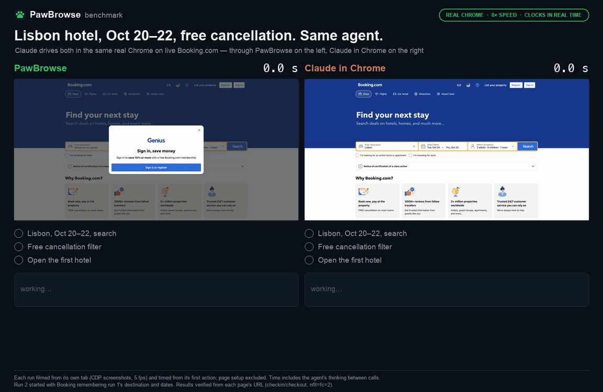

<p align="center">
  
</p>

<h1 align="center">
   PawBrowse
</h1>

<p align="center"><strong>Let Claude Code drive your real, logged-in Chrome — open source, no keys, no second model.</strong></p>

<p align="center">
<a href="https://www.npmjs.com/package/pawbrowse"></a>
<a href="https://chromewebstore.google.com/detail/ppfdoledneneiaflggcfogecfnhkmloe"></a>
<a href="LICENSE"></a>
<a href="CONTRIBUTING.md"></a>
<a href="package.json">=18"></a>

<a href="https://claude.com/claude-code"></a>
<a href="https://modelcontextprotocol.io"></a>
</p>

<p align="center">
  <a href="assets/demo.mp4"></a>
</p>

<p align="center"><sub>
A real run on live Google Flights at <b>1× speed</b> — every frame is the original screencast, the result is verified from the page itself.
The plan is scripted, so this is PawBrowse's browser time only; your agent's thinking time comes on top.
<a href="assets/demo.mp4">MP4</a> · reproduce with <code>node scripts/demo/record.mjs rec && python3 scripts/demo/render.py rec</code>
</sub></p>

PawBrowse is a **Chrome MV3 extension + a tiny zero-dependency MCP server** that lets your local
AI coding agent (like **Claude Code**) read and act on your **actual, logged-in browser tabs** —
your profile, your sessions, your open pages — with **no remote-debug port, no browser relaunch,
and no separate AI model or API key.**

It's the open, self-owned answer to "I wish my agent could just use my real browser": the same
capability as the first-party Claude-in-Chrome extension, but **yours, auditable, MCP-native, and
faster per action** (see the [benchmark](#benchmark) below).

```
Claude Code ──stdio (MCP)──▶ mcp/server.mjs ─┐
Cursor      ──stdio (MCP)──▶ mcp/server.mjs ─┼─IPC─▶ broker ──ws://127.0.0.1:10577──▶ Chrome extension ──CDP──▶ your real tabs
VS Code     ──stdio (MCP)──▶ mcp/server.mjs ─┘                                              │
                                                                    each session ⇒ its own 🐾 tab group
```

**Run as many sessions as you want.** The first one starts a shared *broker* that owns the port
and the extension; every other session just connects to it. Each session gets its **own tab group**
(named `🐾 PawBrowse`, its own color) and drives only its own tab, so several editors/agents can
automate the browser at once without fighting over a port or a tab. Close a session and its tabs are
cleaned up; the broker reaps itself when the last session ends. Nothing to configure — no ports, no
"already in use."

---

## Getting started

Two one-time steps, about 30 seconds. PawBrowse is a **Chrome extension** (the hands + eyes in
your browser) plus a tiny **local server** your AI client runs — both install with a click.

### 1 — Add the extension to Chrome

[](https://chromewebstore.google.com/detail/ppfdoledneneiaflggcfogecfnhkmloe)

> Live on the **[Chrome Web Store](https://chromewebstore.google.com/detail/ppfdoledneneiaflggcfogecfnhkmloe)** — one click, done.

### 2 — Connect your AI client (one time)

<p>
<a href="cursor://anysphere.cursor-deeplink/mcp/install?name=pawbrowse&config=eyJjb21tYW5kIjoibnB4IiwiYXJncyI6WyIteSIsInBhd2Jyb3dzZUBsYXRlc3QiXX0="></a>
<a href="https://insiders.vscode.dev/redirect/mcp/install?name=pawbrowse&config=%7B%22command%22%3A%22npx%22%2C%22args%22%3A%5B%22-y%22%2C%22pawbrowse%40latest%22%5D%7D"></a>
<a href="https://github.com/ItaiZeilig/pawbrowse/raw/main/dist/pawbrowse.mcpb"></a>
</p>

**Claude Desktop** — click the button above to download `pawbrowse.mcpb`, then **double-click it**
(or drag it into **Settings → Extensions**) and click **Install**. No command, no config.

**Claude Code** — one line (the CLI has no click-to-install, so paste this):

```bash
claude mcp add --scope user pawbrowse -- npx -y pawbrowse@latest
```

Then **fully restart your client** and ask: *"use pawbrowse: what's my browser status?"* — you
should see `extension_connected: true`, and the extension badge turns **green ●**.

> Needs **Node.js ≥ 18**. Works with Claude Code, Cursor, VS Code, or any MCP client — the one
> button/line just tells your client to run `npx -y pawbrowse@latest`; nothing to clone or build.
>
> Building from source or contributing? See **[CONTRIBUTING.md](CONTRIBUTING.md)**.

## Using it

You don't call the tools yourself — you just **ask Claude Code in plain language**, and it uses
PawBrowse to drive whatever tab you point it at. Some things to try:

- *"Open news.ycombinator.com and give me the top 5 story titles."*
- *"On this tab, search for 'open source license' and open the first result."*
- *"Fill the signup form on the current page with my name and email, but don't submit."*
- *"Go to my GitHub notifications and tell me what's new."*

Tips:
- It acts on the **tab you have open and are logged into** — no separate window, no re-login.
- Point it at a specific tab by name, or it uses the active tab.
- It reads the page as a list of controls and clicks/types precisely — no screenshots needed.

## Troubleshooting

| Symptom | Fix |
| --- | --- |
| Badge never turns green | The server isn't running — make sure you **fully restarted** Claude Code after `claude mcp add` (a `/mcp` reconnect alone won't relaunch it). |
| "No extension connected" | Reload the extension at `chrome://extensions`, then re-run `browser_status`. |
| "Another debugger is already attached" | That tab has DevTools open or another extension driving it — close DevTools or switch tabs. |
| A `chrome://` / Web Store page won't drive | Those are browser pages Chrome blocks from automation — use a normal web page. |
| Changed the port | Set the same port in the extension's **Options** and in `--env PAWBROWSE_PORT=…`. |

> Requires **Node ≥ 18** (≥ 22 to run the test suite). Works on Chrome, Edge, and Brave.

---

## Highlights

- **Your real browser.** Uses Chrome's built-in `chrome.debugger` (CDP) on tabs you already have
  open and logged into — no `--remote-debugging-port`, no relaunch, no separate profile.
- **The agent is the policy.** No second model, no `TYPESAFE_API_KEY`, no OpenRouter — *you*
  (Claude) decide every action. Page content flows to your agent as normal tool results and
  **never leaves for any third-party server.**
- **Reads pages as an element table, not screenshots.** A compact, numbered list of the actionable
  controls in view — cheap in tokens, fast to reason over, precise to act on.
- **Fast.** Stable element refs let it act in one round trip — **~2.2× faster per action** than the
  closed alternative in testing.
- **Zero dependencies, MIT, extensible.** The whole server is one auditable `.mjs` file; the
  extension is plain JS. Add a tool or an op in minutes.

## Benchmark

<p align="center">
  <a href="assets/benchmark.mp4"></a>
</p>

<p align="center"><sub>
Same task on live Booking.com (Lisbon, Oct 20–22, free cancellation, open the first hotel), same agent (Claude), same real Chrome.
Each run filmed from its own tab and timed from its first action; played at 8×, clocks in real time. <a href="assets/benchmark.mp4">MP4</a>
</sub></p>

| | PawBrowse | Claude in Chrome |
| --- | --- | --- |
| Wall-clock (incl. the agent's thinking) | **102.5 s** | 112.9 s |
| Tool calls | **8** (12 actions) | 11 (19 actions) |
| Screenshots needed to check state | **0** — every call returns the page's fresh element table | 3 |
| Surprises handled | sign-in popup reported ("element is disabled") and dismissed; new tab followed automatically | a filter click that silently didn't apply, caught from a screenshot and retried |

> **Honest caveats:** most of the time on both sides is the agent thinking between calls, so the
> wall-clock gap is modest. The structural signal is **fewer calls and no screenshots** — PawBrowse
> returns the page's state with every action, so the agent never has to "look again". Run 2 (Claude in
> Chrome) also started with Booking remembering run 1's destination and dates. One run each; treat it
> as an illustration, not a statistic. Reproduce: `scripts/demo/peek-record.mjs` films a tab,
> `scripts/demo/render_compare.py` renders the comparison.

## How it compares

| | Claude-in-Chrome | **PawBrowse** |
| --- | --- | --- |
| Drives your real, logged-in Chrome | ✅ | ✅ (`chrome.debugger`, no port) |
| Decision model | Claude | **Claude — no second model, no key** |
| Perception | screenshots + a11y tree | **compact element table** |
| Round trips per action | 2 (perceive → act) | **1** (stable refs) |
| Page data to a third party | no | **no** |
| Per-site permission gate | yes (allowlist) | no |
| Open source / self-owned | ❌ | **✅ MIT, zero-dep** |
| Works with any MCP client | ❌ | **✅** |

## The element table

Every observation returns a compact, numbered table of the **in-viewport, actionable** controls —
with proper accessible names, current values, and state flags — instead of a screenshot:

```
Web browser - Wikipedia  —  https://en.wikipedia.org/wiki/Web_browser
scroll 0/6361  ·  83 controls
e2   fill    "Search Wikipedia"
e6   click   "Log in"
e10  click   "2 History"
e13  click ▾ "Toggle Browser market subsection"
e9   click✓  "Remember me"
e3   select  "Country"  opts{US | UK | ...}
```

Flags after the kind: `✓`/`·` checked/unchecked · `▾`/`▸` expanded/collapsed (open vs closed menu,
combobox, accordion) · `◉` selected (active tab/option). Refs like `e10` derive from a **stable node
identity**, so the agent can act on a control by ref in **one round trip**.

## Tools

| Tool | Purpose |
| --- | --- |
| `browser_status` | Connection + attached-tab diagnostics. Call first if anything's off. |
| `browser_tabs` | List open tabs (`id`, `title`, `url`, `active`). |
| `browser_navigate` | `{ url, tabId? }` → element table after load. |
| `browser_observe` | `{ tabId? }` → the element table. |
| `browser_read` | `{ tabId?, max_chars? }` → the page's readable prose (articles, docs, rules). |
| `browser_act` | `{ ops: [...], tabId? }` → runs ops in order, returns a fresh table + a "page changed?" signal. |
| `browser_assert` | `{ contains? \| url_includes? \| ref_visible?, tabId? }` → prove an outcome (pass/fail). |

**Ops for `browser_act`:** `{op:"click",ref:"e12"}` · `{op:"click_text",text:"..."}` (for custom
widgets/menus not in the table) · `{op:"type",ref:"e7",text:"..."}` · `{op:"select",ref:"e8",value:"..."}`
· `{op:"key",key:"Enter"}` · `{op:"scroll",dy:600}` · `{op:"wait",ms:500}`.

## Reliability & safety engineering

PawBrowse was hardened through two multi-agent code audits **and** live testing on real sites:

- **Hit-tested clicks.** Before every click it re-resolves the element live and verifies the center
  isn't covered (`elementFromPoint`), so it never clicks a stale, moved, or occluded target.
- **Semantic freshness guard.** An element's role + accessible name is fingerprinted at observe time
  and re-checked before acting — a silently relabeled target is rejected ("observe again") instead
  of mis-clicked.
- **Robust fill.** Select-all + `insertText`, which works with React/controlled inputs; typed
  comboboxes wait for their autocomplete options to actually render.
- **Background-tab safe.** Uses `Emulation.setFocusEmulationEnabled` and `setTimeout`-based waits
  (never `requestAnimationFrame`, which Chrome pauses in background tabs) so driving a tab you aren't
  looking at doesn't hang.
- **No double-execution.** If a post-action read fails because the page is navigating, the ops are
  reported as executed ("call observe next") rather than surfaced as a failure to retry.
- **Serialized, unwedgeable command queue** — overlapping calls can't race the debugger, and one
  hung command can't block the rest.

## Security & privacy

- **No data leaves your machine.** There's no model and no API key; page content goes only to the
  agent you run locally. `password`, `file`, and `hidden` inputs are excluded and never exposed.
  (Other visible fields — e.g. text inputs — *are* part of the element table, so treat what's on
  screen as visible to your agent.)
- **Local-only bridge.** The WebSocket binds to `127.0.0.1`, rejects non-`chrome-extension://`
  origins (so a web page can't connect), trusts only the current extension socket, caps inbound
  frame size, and rejects malformed/oversized frames. **Trust model:** the bridge trusts any
  *local* process on `127.0.0.1` (there's no shared token yet), so it assumes other software on
  your machine is trusted — the same assumption as most localhost dev tools. A per-pair token is
  planned hardening.
- **One powerful permission, no host permissions.** The extension declares `debugger` (plus `tabs`,
  `storage`, `alarms`) and **no** host permissions — `chrome.debugger` doesn't need them. That's the
  same capability class as any real-browser agent; use it deliberately.
- **Fully auditable.** The server is one zero-dependency file; the extension is plain JS.

Found a vulnerability? See **[SECURITY.md](SECURITY.md)** — please don't open a public issue.

## Privacy policy

PawBrowse is built to collect nothing. Full policy: **[PRIVACY.md](PRIVACY.md)**. In short:

- **Collection / use:** PawBrowse has no AI model, no account, no API key, and **no telemetry or
  analytics**. Page content it reads (element tables, page text) is returned only to the local AI
  client you run, to fulfill your request.
- **Storage:** the only thing stored is your **bridge port number**, in `chrome.storage.local` on
  your machine. Page content is not persisted by the extension beyond the current operation.
- **Sharing:** nothing is sent to the developer or any third-party server. All traffic stays on
  `127.0.0.1` (localhost) between the extension and the server on your own computer.
- **Retention:** none — there is no server-side data, so there is nothing to retain or delete.
- **Contact:** questions or requests via [GitHub issues](https://github.com/ItaiZeilig/pawbrowse/issues).

## Notes & limits

- Attaching shows Chrome's "PawBrowse is debugging this browser" banner — expected.
- One debugger client per tab: a tab with DevTools open (or driven by another extension) can't be
  attached — switch tabs or close DevTools.
- `chrome://`, the Chrome Web Store, and other browser pages can't be driven.
- **One active client at a time.** The bridge is a single localhost port, so PawBrowse can be driven
  by one client at a time (e.g. Claude Code *or* Claude Desktop). A second client reports the port
  is in use via `browser_status` rather than failing hard; set a different `PAWBROWSE_PORT` per
  client if you need both.
- **Shadow DOM and same-origin iframes are enumerated** (v0.4.0): controls inside open shadow roots
  (web components) and same-origin iframes appear in the element table and are clickable/typable by
  ref. **Not yet:** cross-origin iframes (the browser blocks JS access to them), canvas, and file
  uploads.

## Contributing

Contributions welcome — see **[CONTRIBUTING.md](CONTRIBUTING.md)** for dev setup, tests (`npm test`),
and the PR process. By participating you agree to the **[Code of Conduct](CODE_OF_CONDUCT.md)**.
Questions? **[SUPPORT.md](SUPPORT.md)**.

## Credits

Built with [Claude Code](https://claude.com/claude-code). Some of the page-perception and
action-execution techniques are adapted from
[browser-use/jev-ultrafast](https://github.com/browser-use/jev-ultrafast) (MIT); this credit is kept
as required by that project's license.

## License

[MIT](LICENSE) © PawBrowse contributors.
